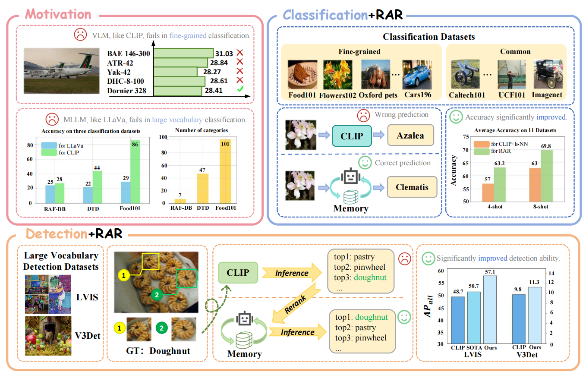

<p align="center">
  <h1 align="center"></h1>
  <h1 align="center">RAR: Retrieving And Ranking Augmented MLLMs for Visual Recognition</h1>
    <p align="center">
    <a href="https://github.com/Liuziyu77"><strong>Ziyu Liu*</strong></a>
    ·
    <a href="https://github.com/SunzeY"><strong>Zeyi Sun*</strong></a>
    ·
    <a href="https://yuhangzang.github.io/"><strong>Yuhang Zang</strong></a>
    ·
    <a href="https://panzhang0212.github.io/"><strong>Pan Zhang</strong></a>
    ·
    <a href="https://lightdxy.github.io/"><strong>Xiaoyi Dong</strong></a>
    ·
     <a href="https://scholar.google.be/citations?user=41KAd6AAAAAJ&hl=en"><strong>Wei Li</strong></a>
    ·
     <a href="http://yjxiong.me/"><strong>Yuanjun Xiong</strong></a>
    ·
     <a href="http://dahua.site/"><strong>Dahua Lin</strong></a>
    ·
     <a href="https://myownskyw7.github.io/"><strong>Jiaqi Wang</strong></a>
  </p>
  <h2 align="center">Submitted to arXiv</h2>
  📖<a href="https://arxiv.org/pdf/2403.13805.pdf">Paper</a> |🏠<a href="https://liuziyu77.github.io/RAR/">Homepage</a></h3>
<div align="center"></div>
<p align="center">
  <p>
In this paper, we highlight the potential of combining <strong>retrieving and ranking</strong> with multi-modal large language models to revolutionize perception tasks such as fine-grained recognition, zero-shot image recognition, and few-shot object recognition. Motivated by the limited zero-shot/few-shot of CLIP and MLLMs on fine-grained datasets, our <strong>RAR</strong> designs the pipeline that uses MLLM to rank the retrieved results. Our proposed approach can be seamlessly integrated into various MLLMs for real-world applications where the variety and volume of categories continuously expand. Our method opens up new avenues for research in augmenting the MLLM’s abilities with the retrieving-augmented solution and could be beneficial for other tasks such as reasoning and generation in future works.
  </p>
  <a href="">
    
  </a>
<br>

## 📢 News
- 🚀 [03/20/2024] We upload part of our code in github, including Fine-Grained Visual Recognition and Few-Shot Image Recognition. More updata is coming soon!!!
- 🚀 [03/20/2024] Our work is submitted to arXiv.

## 💡 Highlights
- 🔥 We conduct an in-depth analysis of the strengths and weaknesses of VLMs and MLLMs in processing fine-grained datasets.
- 🔥 Our RAR can be seamlessly integrated into various MLLMs in a plug-and-play manner.
- 🔥 Through rigorous testing across 11 classification datasets and 2 object detection datasets, we demonstrate that our method outperforms baselines on a variety of visual recognition tasks.

## 🛠️ Usage

### 📃 Contents
- [Install](#install)
- [Prepare Data](#Prepare-Data)
- [Few-Shot Image Classification](#Few-Shot-Image-Classification)
- [Fine-Grained Visual Recognition](#Fine-Grained-Visual-Recognition)


### 🛠️ Install

If you are not using Linux, do *NOT* proceed, see instructions for [macOS](https://github.com/haotian-liu/LLaVA/blob/main/docs/macOS.md) and [Windows](https://github.com/haotian-liu/LLaVA/blob/main/docs/Windows.md).

1. Clone this repository and navigate to RAR folder
```bash
git clone https://github.com/Liuziyu77/RAR.git
cd RAR
```
2. Prepare the environment step-by-step:
```
conda create -n rar python=3.10.13 -y  # create RAR conda environment
conda activate rar  # activate the environment and install dependencies
```

### 💾 Prepare Data
Navigate to the **CLIP-Cls** folder, and prepare the data following the instructions.

### 🔍 Few-Shot Image Classification
#### 📋 Build memory
Navigate to the **Few_shot** folder, and run `build_memory.ipynb` step by step to construct the the external memory.
When you finish the step above, three files will be generated:
```
{dataset_name}_{shot_number}_shot_database.txt
{dataset_name}_{shot_number}_shot_img_index.index
predictions_{shot_number}_shot_knn.pth

# For different datasets, we have different files.
# eg. caltech101_4_shot_database.txt
# eg. eurosat_8_shot_img_index.index
# eg. predictions_16_shot_knn.pth
```
The index file stores the indices of image embeddings that make up the memory. The txt file includes filenames and labels in corresponding order. The pth file contains test results obtained using the CLIP+KNN method, and you can use the code in CLIP_Cls to test its accuracy.

#### 📋 Retrieve and Rank
After that, you can test the retrieve and rank by run `retrieve_and_rerank.py`. And a new pth file will be saved, it records the answers of VLM after ranking the retrieved results.
Before you run `retrieve_and_rerank.py`, three parameters are needed to change:
```
shot_number = 4
top_k = 5
dataset_name = 'caltech101'
```
`shot_number = 4` corresponds to `4-shot` setting, `top_k` controls the number of retrievd items, and `dataset_name` decides which dataset to be tested.


### 🔍 Fine-Grained Visual Recognition
In this experiment, our testing is based on the [FineR](https://github.com/OatmealLiu/FineR). Therefore, the first step is to clone the project using the `git clone` command and install the required environment.

After that, navigate to the **Fine-Grained Visual Recognition** folder, run `build_memory.ipynb` step by step to build the memory for five datasets(Pets37, Dogs120, Cars196, Flowers102 and Bird200). Here, we have prepared the built memory index and category names in `Fine-Grained Visual Recognition/database` folder, the fold is organized as shown below:
```
├── database/
│   └── Pets37/
|       ├── classnames.txt
|       ├── paired_data_pets.txt
|       ├── pets37_database.index
|       ├── pets37_database.txt
│   └── Dog120/
│   └── Flowers102/
│   └── Cars196/
│   └── Bird200/ 
```
Next, you can run our provided `Fine-Grained Visual Recognition/retrieve_test.ipynb` code to use our retrieval method for reselecting names. When U get the names, replace these names in `FineR/experiments/pet37/guess/pet_llm_gussed_names_3.json` with these new names, and run `sh FineR/scripts_eval/p_pipe.sh` to eval the sACC and cACC.

## 📄 License
  **Usage and License Notices**: The data and code are intended and licensed for research use only.
